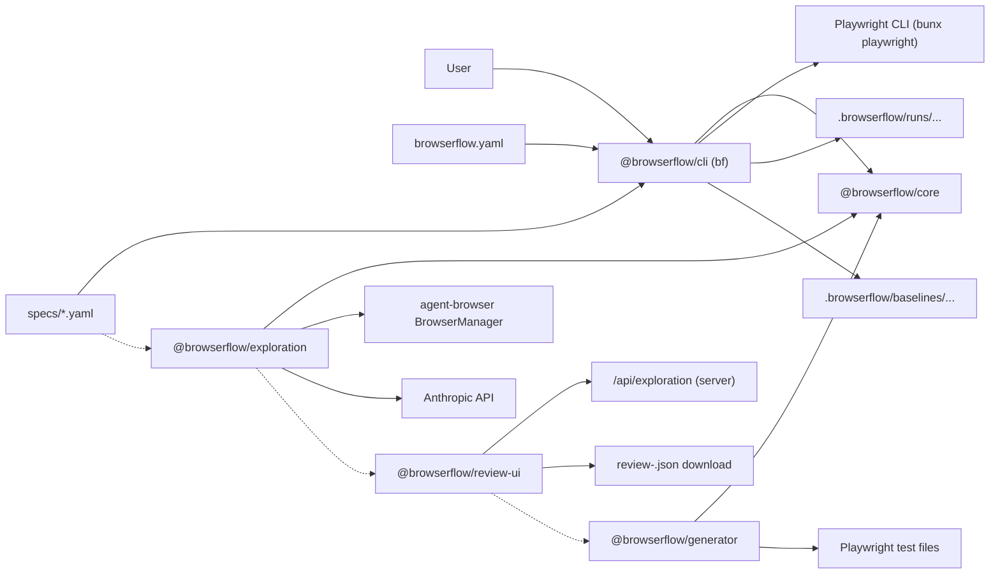
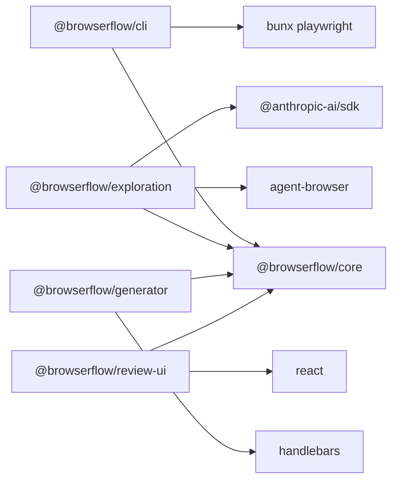
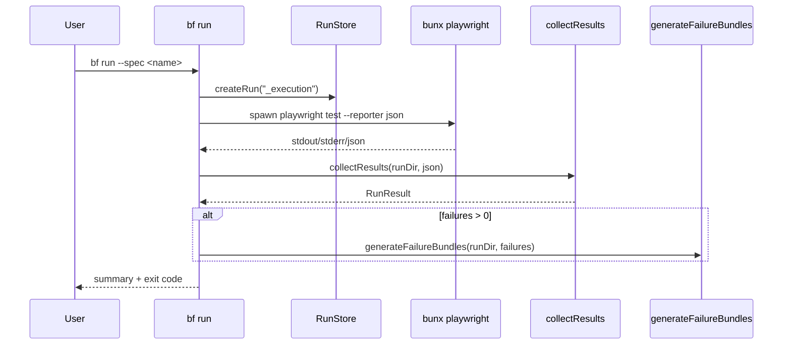
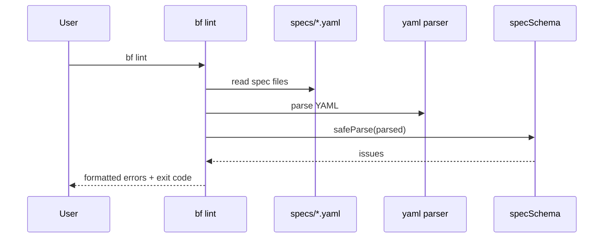
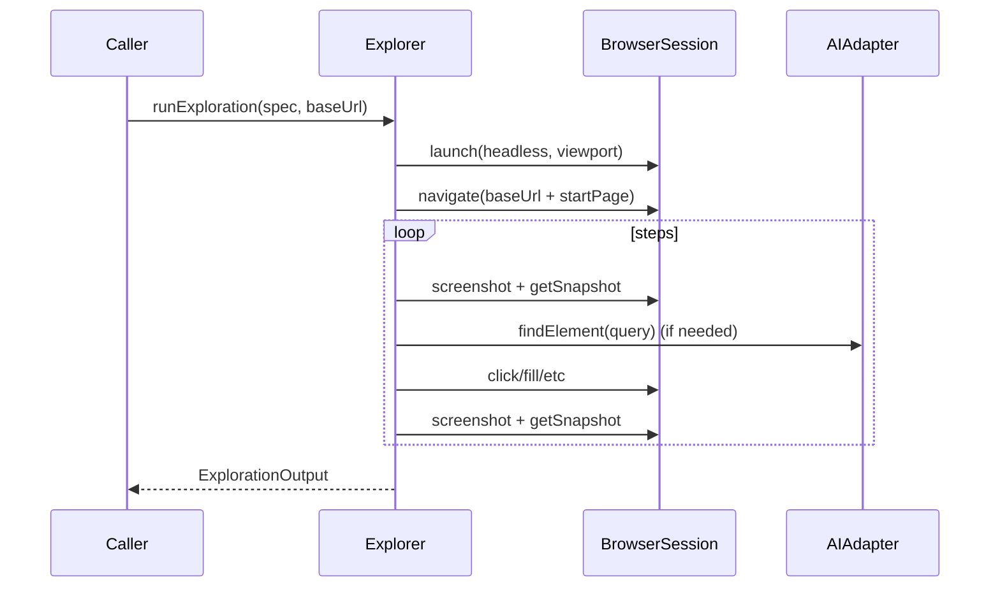
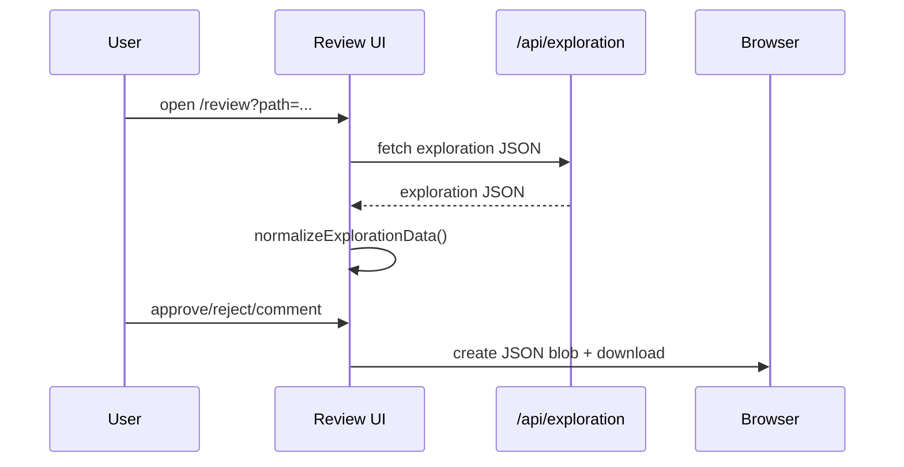
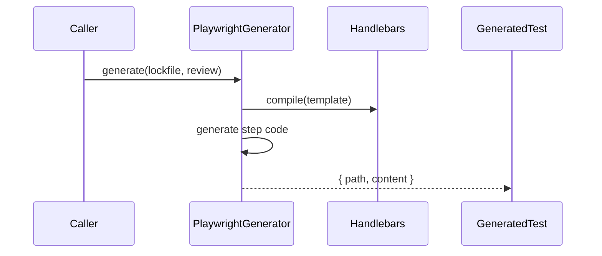
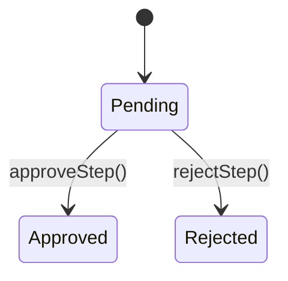

# BrowserFlow Architecture Report

## Executive Summary
BrowserFlow is a Bun/TypeScript monorepo built around a human-in-the-loop E2E workflow. The core package provides schemas and shared types (spec, config, lockfile, locator model, run-store), the CLI exposes project commands (init, doctor, lint, run, baseline, repair), the exploration package orchestrates AI-driven browser sessions via BrowserSession and AIAdapter abstractions, the generator emits Playwright tests from exploration lockfiles, and the review UI is a React SPA for manual approval of exploration steps. (`packages/core/src/spec-schema.ts:207`, `packages/core/src/config-schema.ts:65`, `packages/core/src/lockfile.ts:90`, `packages/cli/src/index.ts:11`, `packages/exploration/src/explorer.ts:91`, `packages/generator/src/playwright-ts.ts:74`, `packages/review-ui/src/main.tsx:1`)

Observed integration is partial: the CLI only runs existing Playwright tests and manages run artifacts, exploration evidence capture and adapter exploration are stubbed, the review UI fetches exploration JSON from an API endpoint and downloads review JSON locally, and a separate legacy bash CLI exists with stubbed commands. These gaps create mismatches between schemas and runtime wiring that are architectural risks. (`packages/cli/src/commands/run.ts:39`, `packages/exploration/src/evidence.ts:62`, `packages/exploration/src/adapters/claude.ts:159`, `packages/review-ui/src/hooks/useExplorationData.ts:33`, `packages/review-ui/src/App.tsx:100`, `bin/bf:20`)

## Evidence Conventions
- Observed: directly supported by code in this repo.
- Inferred: deduced from documentation or naming; marked explicitly.
- File references use `path:line`.

## System Overview Diagram

Note: dashed edges are inferred from docs/legacy CLI and are not wired in code.

## Entry Points and Bootstrap
| Entry Point | Type | Bootstrap sequence | Evidence |
| --- | --- | --- | --- |
| `bin/bf` | Bash CLI | `main` dispatches to command functions; several commands are stubbed | `bin/bf:20`, `bin/bf:182` |
| `packages/cli/bin/bf.js` | Node CLI | Imports `run()` from built dist and executes | `packages/cli/bin/bf.js:1` |
| `packages/cli/src/index.ts` | CLI program | Builds Commander program and registers subcommands; runs when `import.meta.main` | `packages/cli/src/index.ts:11`, `packages/cli/src/index.ts:34` |
| `packages/core/scripts/generate-schemas.ts` | Bun script | Generates JSON schemas from Zod and writes to `schemas/` | `packages/core/scripts/generate-schemas.ts:1` |
| `packages/review-ui/src/main.tsx` | React entry | Creates React root and renders `<App />` | `packages/review-ui/src/main.tsx:1` |

## Module and Package Structure
### Package Map
| Package | Responsibility | Category | Depends on | Evidence |
| --- | --- | --- | --- | --- |
| `packages/core` | Spec/config/lockfile schemas, locator model, run-store utilities | Core domain | zod, playwright-core | `packages/core/src/spec-schema.ts:207`, `packages/core/src/locator-object.ts:71`, `packages/core/src/lockfile.ts:90` |
| `packages/cli` | CLI commands for init/doctor/lint/run/baseline/repair | Interface + infrastructure | core, commander, yaml, Playwright CLI | `packages/cli/src/index.ts:11`, `packages/cli/src/commands/run.ts:39` |
| `packages/exploration` | AI exploration orchestration, BrowserSession + AIAdapter | Infrastructure | agent-browser, Anthropic SDK | `packages/exploration/src/explorer.ts:91`, `packages/exploration/src/agent-browser-session.ts:8`, `packages/exploration/src/adapters/claude.ts:69` |
| `packages/generator` | Playwright test and config generation from lockfiles | Infrastructure | core, handlebars | `packages/generator/src/playwright-ts.ts:74`, `packages/generator/src/config-emit.ts:118` |
| `packages/review-ui` | React review UI for explorations | Interface | core, react | `packages/review-ui/src/App.tsx:6` |
| `bin/bf` | Legacy bash CLI with stub commands | Interface (legacy) | shell tools | `bin/bf:1` |

### Dependency Graph (packages only)


## Component Deep Dives
### @browserflow/core
- Responsibility: Zod schemas for specs/config/lockfile, locator model, run-store, and shared types. (`packages/core/src/spec-schema.ts:207`, `packages/core/src/config-schema.ts:65`, `packages/core/src/lockfile.ts:90`)
- Key types: `BrowserFlowSpec`, `LocatorObject`, `Lockfile`, `ReviewData`. (`packages/core/src/spec-schema.ts:241`, `packages/core/src/locator-object.ts:71`, `packages/core/src/lockfile.ts:90`, `packages/core/src/config.ts:77`)
- Dependencies: Zod for validation, Playwright core for locator resolution. (`packages/core/src/spec-schema.ts:7`, `packages/core/src/locator-object.ts:8`)
- Evidence snippet (schema enforcement):
```ts
export const specSchema = z
  .object({
    version: z.literal(2),
    name: z.string().regex(/^[a-z0-9-]+$/, 'Name must be kebab-case (lowercase letters, numbers, and hyphens only)'),
    description: z.string().optional(),
    steps: z.array(stepSchema).min(1, 'At least one step required'),
    timeout: durationSchema.optional(),
  });
```
(`packages/core/src/spec-schema.ts:207`)

### @browserflow/cli
- Responsibility: Provide CLI commands for initialization, environment checks, spec linting, test execution, baselines, and repair. (`packages/cli/src/index.ts:11`)
- Entry points: Node bin `bf.js` calls `run()`; `run()` registers commands with Commander. (`packages/cli/bin/bf.js:1`, `packages/cli/src/index.ts:11`)
- Execution pipeline for `bf run`: resolve specs, create run dir, spawn Playwright with JSON reporter, collect results, generate failure bundles. (`packages/cli/src/commands/run.ts:39`, `packages/cli/src/run/executor.ts:12`, `packages/cli/src/run/results.ts:7`)
- Evidence snippet (run pipeline):
```ts
const runDir = await runStore.createRun('_execution');
const executorResult = await executePlaywright(specs, options, runDir);
const summary = await collectResults(runDir, executorResult);
if (summary.failed > 0) {
  await generateFailureBundles(runDir, summary.failures);
}
```
(`packages/cli/src/commands/run.ts:39`)

### @browserflow/exploration
- Responsibility: Orchestrate AI exploration via `Explorer`, using a `BrowserSession` abstraction and an `AIAdapter` for element resolution. (`packages/exploration/src/explorer.ts:30`, `packages/exploration/src/adapters/types.ts:181`)
- Browser integration: `AgentBrowserSession` wraps agent-browser's `BrowserManager`. (`packages/exploration/src/agent-browser-session.ts:8`)
- Execution model: `runExploration()` launches browser, navigates, executes steps with screenshots and snapshots, and returns `ExplorationOutput`. (`packages/exploration/src/explorer.ts:136`)
- Evidence snippet (BrowserSession interface):
```ts
export interface BrowserSession {
  launch(options?: BrowserLaunchOptions): Promise<void>;
  navigate(url: string): Promise<void>;
  screenshot(): Promise<Buffer>;
  getSnapshot(options?: { interactive?: boolean }): Promise<EnhancedSnapshot>;
  close(): Promise<void>;
}
```
(`packages/exploration/src/explorer.ts:30`)

### @browserflow/generator
- Responsibility: Convert exploration lockfiles into Playwright tests using Handlebars templates; generate Playwright config templates. (`packages/generator/src/playwright-ts.ts:74`, `packages/generator/src/config-emit.ts:118`)
- Key types: `ExplorationLockfile`, `ReviewData`, `GeneratedTest`. (`packages/generator/src/playwright-ts.ts:6`)
- Evidence snippet (generator output):
```ts
const content = this.template({
  specName: lockfile.spec,
  specPath: lockfile.spec_path,
  explorationId: lockfile.exploration_id,
  reviewer: review?.reviewer,
  reviewedAt: review?.submitted_at,
});

return {
  path: `tests/${lockfile.spec}.spec.ts`,
  content,
  specName: lockfile.spec,
  explorationId: lockfile.exploration_id,
  generatedAt: new Date().toISOString(),
};
```
(`packages/generator/src/playwright-ts.ts:100`, `packages/generator/src/playwright-ts.ts:112`)

### @browserflow/review-ui
- Responsibility: Load exploration JSON, present step review UI, and output review JSON (download). (`packages/review-ui/src/App.tsx:64`, `packages/review-ui/src/hooks/useExplorationData.ts:33`)
- Data normalization: `useExplorationData` adapts legacy exploration JSON and lockfile-style data into `ExplorationData`. (`packages/review-ui/src/hooks/useExplorationData.ts:78`)
- Evidence snippet (submit workflow):
```ts
const reviewJson = {
  exploration_id: data.id,
  spec_name: data.specName,
  reviewed_at: new Date().toISOString(),
  steps: Object.entries(reviewData).map(([stepIndex, stepData]) => ({
    step_index: parseInt(stepIndex, 10),
    status: stepData.status,
  })),
};

const blob = new Blob([JSON.stringify(reviewJson, null, 2)], { type: 'application/json' });
a.download = `review-${data.id}.json`;
```
(`packages/review-ui/src/App.tsx:100`)

### Legacy Bash CLI (`bin/bf`)
- Responsibility: Legacy CLI dispatch with stubs for explore/review/codify/run/ci. (`bin/bf:20`, `bin/bf:182`)
- Not wired to the TypeScript packages; serves as documentation or placeholder. (`bin/bf:182`)

## Core Data Structures
| Type | Role | Created by | Consumed by | Evidence |
| --- | --- | --- | --- | --- |
| `BrowserFlowSpec` / `SpecStep` | Validated spec format (v2, step ids, action types) | YAML files + linting | Exploration (inferred), generator (inferred) | `packages/core/src/spec-schema.ts:207`, `packages/cli/src/commands/lint.ts:133` |
| `BrowserflowConfig` | Project config (runtime, locators, review, output) | `browserflow.yaml` (`bf init`) | CLI doctor, future runtime config | `packages/core/src/config-schema.ts:65`, `packages/cli/src/commands/init.ts:7`, `packages/cli/src/commands/doctor.ts:131` |
| `LocatorObject` | Stable locator definition with preferred and fallback strategies | Exploration/review (inferred) | Locator resolution + lockfile | `packages/core/src/locator-object.ts:71`, `packages/core/src/lockfile.ts:95` |
| `Lockfile` | Canonical exploration artifact (locators, masks, assertions, generation metadata) | Exploration/review (inferred) | Generator, tooling | `packages/core/src/lockfile.ts:90`, `packages/generator/src/playwright-ts.ts:93` |
| `ExplorationOutput` / `StepResult` | In-memory exploration results (camelCase) | `Explorer.runExploration()` or adapter | Future persistence (inferred) | `packages/exploration/src/adapters/types.ts:48`, `packages/exploration/src/explorer.ts:136` |
| `ReviewData` | Review decisions and metadata | Review UI or API | Generator (for template metadata) | `packages/core/src/config.ts:77`, `packages/generator/src/playwright-ts.ts:93` |
| `RunResult` / `FailureBundle` | Playwright execution summary + failure artifacts | CLI run pipeline | Repair command and baseline workflows | `packages/cli/src/run/results.ts:7`, `packages/cli/src/run/failure-bundle.ts:24` |

## Data Flow Diagrams
### Flow 1: `bf run` (Playwright execution)

- Input boundary: CLI args. (`packages/cli/src/commands/run.ts:11`)
- Transform chain: resolve specs -> spawn Playwright -> parse JSON -> summary. (`packages/cli/src/run/executor.ts:12`, `packages/cli/src/run/results.ts:7`)
- State mutation: writes `.browserflow/runs/_execution/run-<ts>/artifacts` and failure bundles. (`packages/cli/src/run/run-store.ts:14`, `packages/cli/src/run/failure-bundle.ts:272`)
- Output boundary: console output and process exit code. (`packages/cli/src/commands/run.ts:65`, `packages/cli/src/run/output.ts:1`)

### Flow 2: `bf lint` (spec validation)

- Input boundary: YAML files or `specs/` directory. (`packages/cli/src/commands/lint.ts:171`)
- Transform chain: parse YAML -> validate with `specSchema` -> map issues to lines. (`packages/cli/src/commands/lint.ts:115`, `packages/core/src/spec-schema.ts:207`)
- State mutation: none (read-only).
- Output boundary: printed results and exit code 3 on validation errors. (`packages/cli/src/commands/lint.ts:280`)

### Flow 3: `Explorer.runExploration` (AI-driven exploration)

- Input boundary: `Spec` object and base URL. (`packages/exploration/src/explorer.ts:136`)
- Transform chain: snapshot -> AI element lookup -> browser actions. (`packages/exploration/src/explorer.ts:233`, `packages/exploration/src/explorer.ts:355`)
- State mutation: browser session state; screenshots are not persisted in this path (stubs). (`packages/exploration/src/explorer.ts:225`, `packages/exploration/src/evidence.ts:62`)
- Output boundary: `ExplorationOutput` returned to caller. (`packages/exploration/src/adapters/types.ts:48`)

### Flow 4: Review UI (load and submit)

- Input boundary: HTTP fetch from `explorationPath` or `/api/exploration`. (`packages/review-ui/src/hooks/useExplorationData.ts:33`)
- Transform chain: normalize legacy vs lockfile formats. (`packages/review-ui/src/hooks/useExplorationData.ts:78`)
- State mutation: in-memory `reviewData` and `isDirty`. (`packages/review-ui/src/hooks/useReviewState.ts:32`)
- Output boundary: downloaded review JSON file. (`packages/review-ui/src/App.tsx:118`)

### Flow 5: Playwright test generation

- Input boundary: `ExplorationLockfile` and optional `ReviewData`. (`packages/generator/src/playwright-ts.ts:93`)
- Transform chain: template + step code + visual checks. (`packages/generator/src/playwright-ts.ts:135`)
- State mutation: none (pure generation).
- Output boundary: `GeneratedTest` struct for writing to disk. (`packages/core/src/config.ts:91`)

## Control Flow Patterns
- Command dispatch: Commander routes subcommands to handlers. (`packages/cli/src/index.ts:11`)
- Action dispatch: `StepExecutor.executeAction` uses a switch on `step.action` to select behavior. (`packages/exploration/src/step-executor.ts:170`)
- UI state transitions: React hooks in `useReviewState` mutate per-step review state and drive UI rendering. (`packages/review-ui/src/hooks/useReviewState.ts:68`)

## Error Propagation
- CLI run: errors bubble to a top-level try/catch and trigger `process.exit(1)`. (`packages/cli/src/commands/run.ts:28`)
- Exploration: step errors are captured into `errors[]`, but exploration continues and always closes the browser in `finally`. (`packages/exploration/src/explorer.ts:174`, `packages/exploration/src/explorer.ts:203`)
- BrowserSession adapter: wraps agent-browser errors with context-specific messages. (`packages/exploration/src/agent-browser-session.ts:35`)
- Lint: collects errors rather than throwing and sets `process.exitCode = 3` when errors exist. (`packages/cli/src/commands/lint.ts:282`)
- Failure bundle creation: `findTrace`/`findFailureScreenshot` swallow IO errors and proceed with partial artifacts. (`packages/cli/src/run/failure-bundle.ts:165`)

## Interface Boundaries
- `AIAdapter` defines the LLM integration seam. (`packages/exploration/src/adapters/types.ts:181`)
- `BrowserSession` abstracts browser automation for exploration. (`packages/exploration/src/explorer.ts:30`)
- `RunStore` interface in core defines run persistence API for tooling. (`packages/core/src/run-store.ts:44`)
- `customActionHandlers` allow injection of bespoke step behaviors. (`packages/exploration/src/step-executor.ts:16`)

## Pattern Catalog
| Pattern | Location | Purpose | Evidence |
| --- | --- | --- | --- |
| Strategy / Plugin | `AIAdapter` interface + `ClaudeAdapter` | Swap LLM providers | `packages/exploration/src/adapters/types.ts:181`, `packages/exploration/src/adapters/claude.ts:69` |
| Adapter | `AgentBrowserSession` | Wrap agent-browser into `BrowserSession` | `packages/exploration/src/agent-browser-session.ts:8` |
| Command | CLI subcommands via Commander | Encapsulate CLI actions | `packages/cli/src/index.ts:11` |
| Command (domain) | `step.action` switch in `StepExecutor` | Dispatch spec actions to behavior | `packages/exploration/src/step-executor.ts:170` |
| Repository / Store | `RunStore`, `BaselineStore` | Encapsulate FS persistence of runs/baselines | `packages/cli/src/run/run-store.ts:7`, `packages/cli/src/commands/baseline.ts:43` |
| Factory | `createRunStore()` | Create run-store for a project root | `packages/core/src/run-store.ts:71` |
| Template | Handlebars-based generation | Emit Playwright tests/config | `packages/generator/src/playwright-ts.ts:86`, `packages/generator/src/config-emit.ts:118` |
| Observer / Event-driven | child process stdout/stderr listeners | Capture Playwright output incrementally | `packages/cli/src/run/executor.ts:28` |
| Dependency injection | `ExplorerConfig`, `StepExecutorConfig` | Pass adapter/browser/custom handlers | `packages/exploration/src/explorer.ts:74`, `packages/exploration/src/step-executor.ts:16` |
| State machine (implicit) | Review step status | `pending` -> `approved`/`rejected` | `packages/review-ui/src/hooks/useReviewState.ts:104` |

## Layering and Boundaries
Observed layering is hub-and-spoke around `@browserflow/core`. Core provides schemas and shared types, while CLI, exploration, generator, and review UI import core types but do not depend on each other directly. (`packages/core/src/spec-schema.ts:207`, `packages/cli/src/index.ts:11`, `packages/exploration/src/explorer.ts:91`, `packages/generator/src/playwright-ts.ts:74`, `packages/review-ui/src/hooks/useReviewState.ts:1`)
Inferred boundary intent: specs and reviews should flow from exploration to generation, but there is no direct wiring in the CLI, and several data shapes differ (see Technical Debt). (Inference)

## Concurrency Model
- CLI `bf run` spawns Playwright in a child process and listens to stdout/stderr events; execution is asynchronous but single-process. (`packages/cli/src/run/executor.ts:23`)
- Baseline comparison uses `Promise.all` to read files concurrently. (`packages/cli/src/commands/baseline.ts:136`)
- Exploration steps run sequentially in a for-loop; no parallel step execution. (`packages/exploration/src/explorer.ts:173`)
- Review UI uses async `fetch` within a React `useEffect`; no concurrency beyond the browser event loop. (`packages/review-ui/src/hooks/useExplorationData.ts:38`)

Potential hazards:
- Run directories are timestamp-based without locking; concurrent runs could collide or interleave artifacts. (`packages/cli/src/run/run-store.ts:14`)
- Baseline updates and run artifacts share `.browserflow` but lack coordination if multiple processes run concurrently. (`packages/cli/src/commands/baseline.ts:83`)

## State Management
### Review Step State Diagram (observed)

(`packages/review-ui/src/hooks/useReviewState.ts:104`)

### State Ownership Table
| State | Owner | Readers | Writers | Persistence / Recovery | Evidence |
| --- | --- | --- | --- | --- | --- |
| `.browserflow/runs/_execution/*` | CLI `RunStore` | CLI run/baseline/repair | CLI run | FS persists between runs | `packages/cli/src/run/run-store.ts:14` |
| `.browserflow/baselines/*` | CLI `BaselineStore` | Baseline status/accept | Baseline accept | FS persists | `packages/cli/src/commands/baseline.ts:43` |
| `reviewData` (per step) | Review UI hook | Review UI components | Review UI actions | In-memory; exported via JSON download | `packages/review-ui/src/hooks/useReviewState.ts:32`, `packages/review-ui/src/App.tsx:118` |
| `Explorer` step list + errors | `Explorer.runExploration` | Caller | `Explorer` | In-memory; returned in output | `packages/exploration/src/explorer.ts:145` |
| `EvidenceCollector.evidence` | `EvidenceCollector` | Explorer caller | EvidenceCollector | In-memory only (stubs) | `packages/exploration/src/evidence.ts:42` |
| `Lockfile` JSON | core `writeLockfile` | Generator, review UI | future exploration/review | FS persistence | `packages/core/src/lockfile.ts:145` |

## External Dependencies
- Playwright CLI for test execution (`bunx playwright test`). (`packages/cli/src/run/executor.ts:23`)
- Playwright core for locator resolution. (`packages/core/src/locator-object.ts:8`)
- agent-browser for exploration browser sessions. (`packages/exploration/src/agent-browser-session.ts:8`)
- Anthropic SDK for Claude adapter. (`packages/exploration/src/adapters/claude.ts:3`)
- YAML parser for linting and doctor config reads. (`packages/cli/src/commands/lint.ts:9`, `packages/cli/src/commands/doctor.ts:7`)
- React + router for review UI. (`packages/review-ui/src/main.tsx:1`, `packages/review-ui/src/App.tsx:1`)
- Handlebars templates for generation. (`packages/generator/src/playwright-ts.ts:13`)

## Configuration Reference (browserflow.yaml)
Defaults come from the schema or `bf init` template. (`packages/core/src/config-schema.ts:65`, `packages/cli/src/commands/init.ts:7`)
| Key | Type | Default | Notes | Evidence |
| --- | --- | --- | --- | --- |
| `project.name` | string | none | required | `packages/core/src/config-schema.ts:20` |
| `project.base_url` | string (url) | none | optional | `packages/core/src/config-schema.ts:20` |
| `runtime.browser` | enum | `chromium` | alias `browser.engine` | `packages/core/src/config-schema.ts:26` |
| `runtime.headless` | boolean | `true` | | `packages/core/src/config-schema.ts:26` |
| `runtime.viewport` | object | none | width/height integers | `packages/core/src/config-schema.ts:14` |
| `runtime.timeout` | duration or number | none | schema allows string or number | `packages/core/src/config-schema.ts:26` |
| `locators.prefer_testid` | boolean | `true` | | `packages/core/src/config-schema.ts:35` |
| `locators.testid_attributes` | string[] | none | | `packages/core/src/config-schema.ts:35` |
| `exploration.adapter` | string | `claude` | | `packages/core/src/config-schema.ts:41` |
| `exploration.max_retries` | number | `3` | | `packages/core/src/config-schema.ts:41` |
| `review.port` | number | `8190` | | `packages/core/src/config-schema.ts:47` |
| `review.auto_open` | boolean | `true` | | `packages/core/src/config-schema.ts:47` |
| `output.tests_dir` | string | `e2e/tests` | | `packages/core/src/config-schema.ts:52` |
| `output.baselines_dir` | string | `baselines` | | `packages/core/src/config-schema.ts:52` |
| `ci.fail_on_baseline_diff` | boolean | `false` | | `packages/core/src/config-schema.ts:58` |
| `ci.parallel` | number | none | | `packages/core/src/config-schema.ts:58` |

## Extension Points
- Implement new LLM adapters via `AIAdapter`. (`packages/exploration/src/adapters/types.ts:181`)
- Swap browser backend by implementing `BrowserSession`. (`packages/exploration/src/explorer.ts:30`)
- Add custom step actions using `customActionHandlers`. (`packages/exploration/src/step-executor.ts:16`)
- Customize generated tests/config via Handlebars templates. (`packages/generator/src/playwright-ts.ts:86`, `packages/generator/src/config-emit.ts:118`)
- Adjust locator strategy preferences in `LocatorCandidateGeneratorConfig`. (`packages/exploration/src/locator-candidates.ts:31`)

## Architectural Decisions (ADRs)
1. Use Zod schemas for spec/config/lockfile validation.
   - Context: need runtime validation for YAML and JSON artifacts.
   - Decision: define schemas in core and export for linting and JSON schema generation.
   - Tradeoffs: strong validation and IDE support vs duplicated types between packages.
   - Evidence: `packages/core/src/spec-schema.ts:207`, `packages/core/src/config-schema.ts:65`, `packages/core/scripts/generate-schemas.ts:1`.

2. Use Playwright for deterministic execution and JSON reporting.
   - Context: tests must be CI-friendly and deterministic.
   - Decision: CLI spawns Playwright with JSON reporter; generator emits Playwright tests.
   - Tradeoffs: relies on Playwright toolchain and reporter semantics.
   - Evidence: `packages/cli/src/run/executor.ts:23`, `packages/generator/src/playwright-ts.ts:40`.

3. Abstract browser automation behind `BrowserSession` and implement with agent-browser.
   - Context: exploration needs a consistent browser API with snapshot refs.
   - Decision: `BrowserSession` interface + `AgentBrowserSession` adapter.
   - Tradeoffs: tight coupling to agent-browser capabilities.
   - Evidence: `packages/exploration/src/explorer.ts:30`, `packages/exploration/src/agent-browser-session.ts:8`.

4. Provide a pluggable AI adapter interface with Claude as initial implementation.
   - Context: exploration needs LLM-assisted element resolution.
   - Decision: `AIAdapter` contract; `ClaudeAdapter` as default.
   - Tradeoffs: API credentials and latency; explore() currently stubbed.
   - Evidence: `packages/exploration/src/adapters/types.ts:181`, `packages/exploration/src/adapters/claude.ts:69`.

5. Persist run artifacts in `.browserflow` directories.
   - Context: keep artifacts out of repo and per-run isolation.
   - Decision: RunStore creates `.browserflow/runs/...` with artifacts.
   - Tradeoffs: multiple implementations with diverging layouts.
   - Evidence: `packages/cli/src/run/run-store.ts:14`, `packages/core/src/run-store.ts:71`.

6. Template-based generation with Handlebars.
   - Context: need customizable test output.
   - Decision: compile templates for tests and Playwright config.
   - Tradeoffs: template logic can drift from runtime semantics.
   - Evidence: `packages/generator/src/playwright-ts.ts:86`, `packages/generator/src/config-emit.ts:118`.

7. Review UI as a standalone SPA that fetches exploration JSON.
   - Context: decouple review UX from CLI runtime.
   - Decision: React SPA uses fetch and downloads review JSON.
   - Tradeoffs: requires a separate server to provide exploration JSON.
   - Evidence: `packages/review-ui/src/hooks/useExplorationData.ts:33`, `packages/review-ui/src/App.tsx:100`.

## Strengths and Risks
Strengths:
- Strong schema-driven validation and shared typing across packages. (`packages/core/src/spec-schema.ts:207`)
- Clear separation between CLI, exploration, generator, and review UI. (`packages/cli/src/index.ts:11`, `packages/exploration/src/explorer.ts:91`)
- Deterministic Playwright execution with structured JSON results. (`packages/cli/src/run/executor.ts:85`)

Risks:
- Multiple data models for specs and exploration outputs cause mismatches across packages. (see Technical Debt)
- Key pipeline steps (exploration, review server, generation) are not wired into CLI.

## Technical Debt and Risks
| Issue | Severity | Evidence | Impact |
| --- | --- | --- | --- |
| Dual CLI implementations (bash vs Node) with divergent command sets | High | `bin/bf:20`, `packages/cli/src/index.ts:11` | User confusion and inconsistent behavior |
| Spec shape mismatch: core spec schema vs exploration `SpecStep` types | High | `packages/core/src/spec-schema.ts:82`, `packages/exploration/src/adapters/types.ts:83` | Exploration may not accept validated specs |
| `Explorer.runExploration` treats `preconditions.page` as string, but schema defines it as object | High | `packages/exploration/src/explorer.ts:169`, `packages/core/src/spec-schema.ts:171` | Incorrect start page resolution |
| Duration types mismatch (schema uses duration strings, exploration uses numbers) | Medium | `packages/core/src/spec-schema.ts:99`, `packages/exploration/src/adapters/types.ts:94` | Timeouts may be misinterpreted |
| Generator output path (`tests/`) and CLI run path (`e2e/tests/`) differ | Medium | `packages/generator/src/playwright-ts.ts:112`, `packages/cli/src/run/executor.ts:83` | CLI run may not find generated tests |
| Baseline diff uses byte comparison instead of image diff | Medium | `packages/cli/src/commands/baseline.ts:136` | False positives/negatives in visual checks |
| Exploration `explore()` and evidence capture are stubs | High | `packages/exploration/src/adapters/claude.ts:159`, `packages/exploration/src/evidence.ts:62` | Incomplete exploration pipeline |
| Review UI expects `/api/exploration` but no server exists in repo | Medium | `packages/review-ui/src/hooks/useExplorationData.ts:33` | Review UI cannot load data without external server |
| Two run-store implementations with different layouts | Medium | `packages/core/src/run-store.ts:16`, `packages/cli/src/run/run-store.ts:4` | Artifact location inconsistencies |

## Key Invariants
- Spec version must be `2` and step ids must be unique. (`packages/core/src/spec-schema.ts:207`)
- CLI run always writes artifacts under `.browserflow/runs/_execution/run-<timestamp>`. (`packages/cli/src/run/run-store.ts:14`)
- Exploration always closes the browser in a `finally` block. (`packages/exploration/src/explorer.ts:203`)
- Playwright runs use JSON reporter output. (`packages/cli/src/run/executor.ts:85`)
- Lockfile schema requires `locators`, `masks`, `assertions`, and `generation` fields. (`packages/core/src/lockfile.ts:90`)

## Glossary
- Spec: YAML file describing intended user actions and checks (v2). (`packages/core/src/spec-schema.ts:207`)
- Step: Single action inside a spec; executed by exploration or tests. (`packages/core/src/spec-schema.ts:82`)
- Exploration: AI-driven run that records steps, screenshots, and decisions. (`packages/exploration/src/explorer.ts:136`)
- Review: Human approval workflow for exploration steps. (`packages/review-ui/src/App.tsx:64`)
- Lockfile: Canonical exploration artifact containing locators, masks, and assertions. (`packages/core/src/lockfile.ts:90`)
- LocatorObject: Structured locator with preferred and fallback strategies. (`packages/core/src/locator-object.ts:71`)
- Baseline: Stored screenshot for visual regression comparisons. (`packages/cli/src/commands/baseline.ts:13`)
- Failure bundle: Structured failure artifact with trace/screenshot/diff metadata. (`packages/cli/src/run/failure-bundle.ts:24`)

## Verification Notes (2026-01-19)

This report was verified against the codebase on 2026-01-19. Summary of findings:

### Line Number Accuracy
All file:line references were verified. Most are accurate within 1-3 lines:
- `packages/exploration/src/adapters/types.ts:181` for AIAdapter is actually at line 182-184
- All other references are accurate

### Technical Debt Verification
All identified technical debt items were verified as accurate:
- ✅ **preconditions.page mismatch**: Explorer line 169 casts `preconditions.page` as string, but schema defines it as `{ url?: string }`
- ✅ **Duration types mismatch**: Core schema uses duration strings, exploration types use numbers
- ✅ **Generator/CLI path mismatch**: Generator outputs to `tests/`, CLI expects `e2e/tests/`
- ✅ **Evidence stub**: `captureScreenshot` has TODO stub at line 67
- ✅ **Claude explore() stub**: Returns minimal empty structure at line 159
- ✅ **Review UI /api/exploration**: No server implementation exists in repo

### Minor Omissions
The following components exist but are not detailed in the report (minor utilities):
- `packages/core/src/duration.ts` - Duration string parser/formatter used by schemas
- `packages/cli/src/ui/*` - CLI UI utilities (colors, spinner, prompts, box, output, env)
- `packages/generator/src/visual-checks.ts` - Visual regression assertion generation

### Diagram Accuracy
All Mermaid diagrams accurately reflect the code structure and package relationships.
